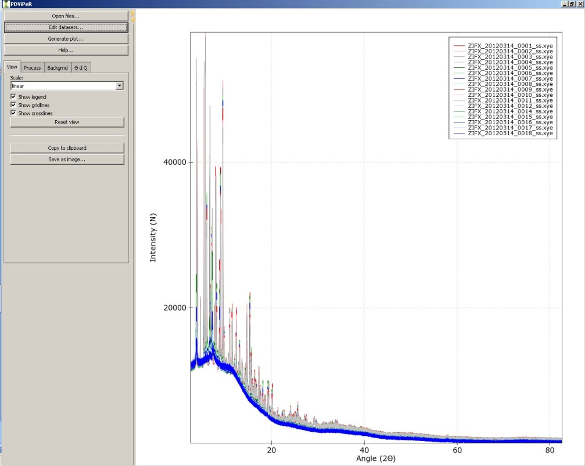
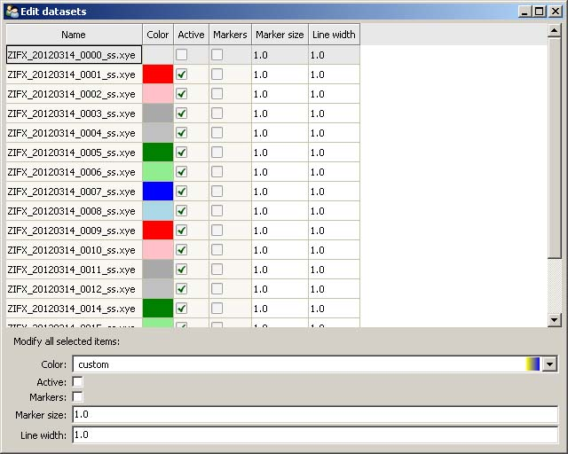
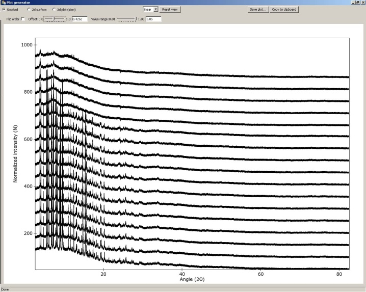
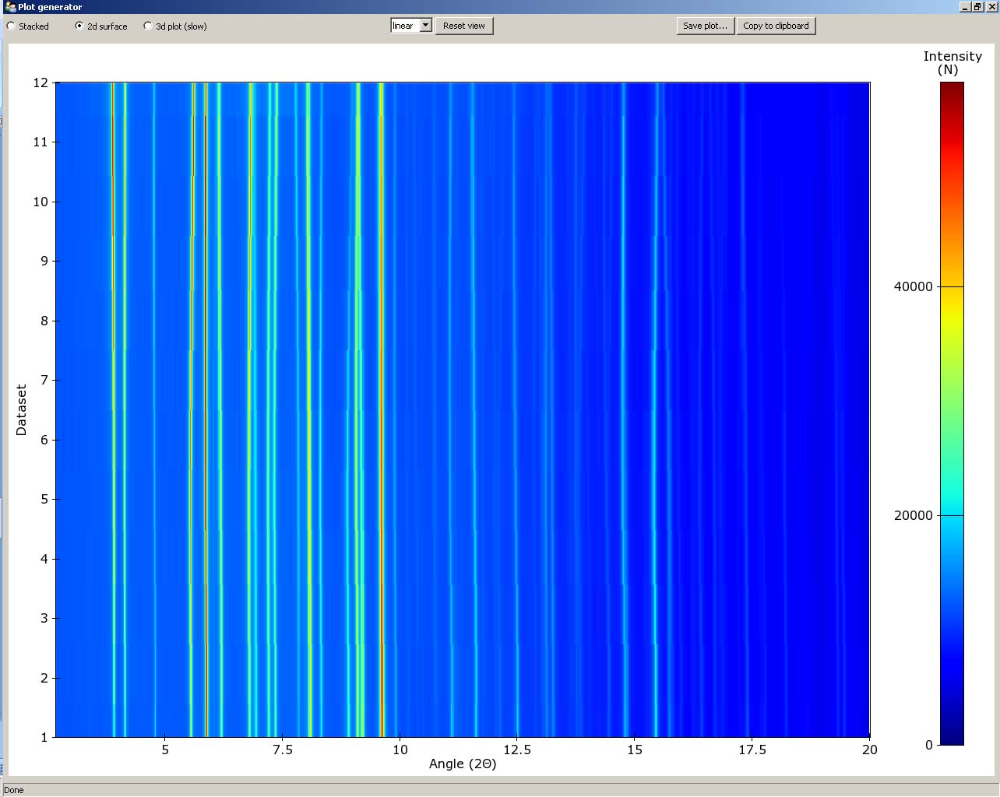
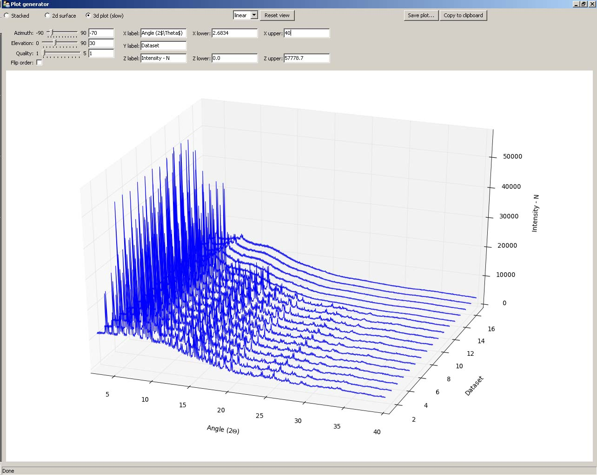
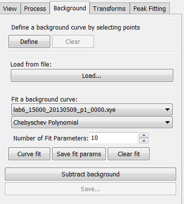
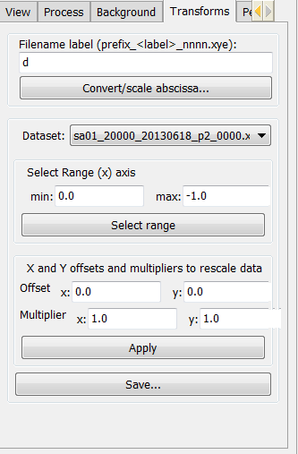
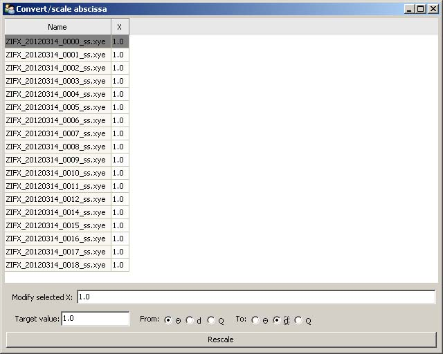
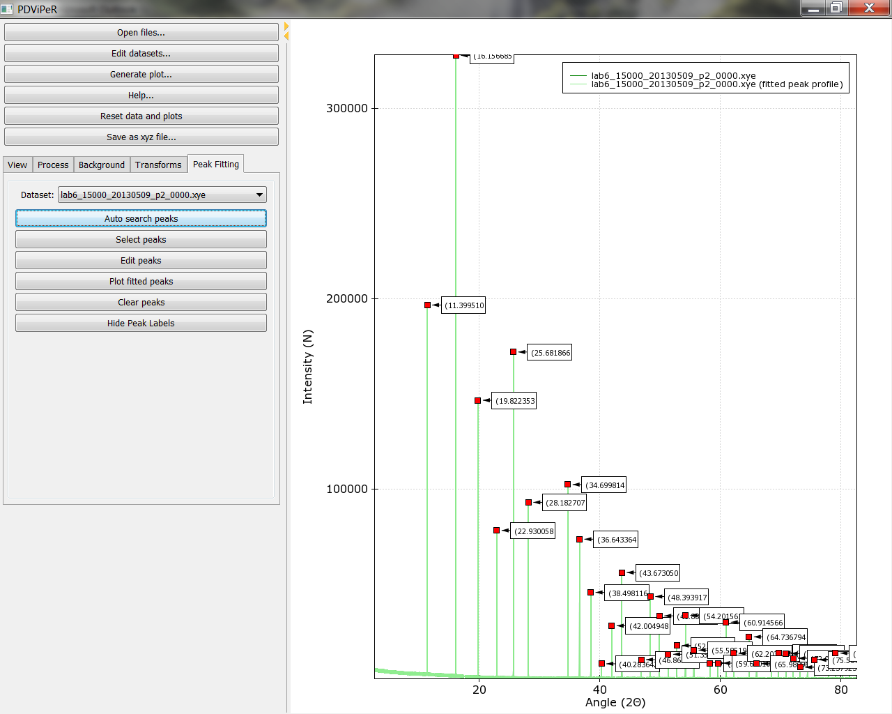

.. _how_to_use_root:

*******************
How to use PDViPeR
*******************
PDViPeR is designed in a modular format, which is grouped into different functions. The software has main explorer menu on the lefthand side and main plot window on the righthand side image (:ref:`figure1`). Both windows are resizable.

.. _figure1:

   Figure 1

.. _read_data:
Read data (viewing module)
=======================

To open a file or group of files, click ‘open files’ from the main menu and select the file(s) you wish to read in.

Note: It is assumed that the data is .xye/.xy format, for processing the data from the MYTHEN detector.  The .parab file is required to be located in the same folder as the data file for many of the functions to work.

* `Format of .xy and .xye files <http://www.synchrotron.org.au/index.php/aussyncbeamlines/powder-diffraction/data-analysis/data-formats>`_ (.xye file: 2theta, intensity, error; .xy file: 2theta, intensity)
* `Format of .parab files <http://www.synchrotron.org.au/index.php/aussyncbeamlines/powder-diffraction/data-analysis/data-formats>`_
* There is a single .parab file for each detector position data file (_p1_-_p4_)

Click “Edit datasets” from main menu permits the user to change the plot colour, marker switch, marker size, line width and select/deselect each dataset (:ref:`figure2`). 

.. _figure2:

   Figure 2

Legend, gridlines, and crosslines can be turn off/on from main menu window using the “show legend”, “show gridlines”, “show crosslines” tick boxes. To zoom, unzoom, pan and drag the dataset in the plot window the left, right mouse button, or keyboard arrow can be used. The plot scale can be set to “linear”, “log”, or “sqrt” in the drop-down menu.
Note: Users can always click “Reset view” bottom to reset plot.
The dataset plot image can be saved via the “Save as image” button located in the main window.
To plot a dataset in 'Stacked', '2d surface', '3d plot' view, click the 'generate plot' menu button.  A new plot generator window will be opened. (:ref:`figure3`.)

.. _figure3:

   Figure 3 

* Stacked plot
  Adjust the 'Offset' and 'Value range' slider controls to change space between the data sets and intensity of the dataset. Tick 'flip order' to reverse the orderChange the plot scale by selecting 'linear', 'log', 'sqrt' options.

* 2d surface
  Double click the plot axis to change the dataset plot range and label. Drag on the scale bar on the right side of the plot to change plot colour scale. (:ref:`figure4`)

.. _figure4:

   Figure 4 

* 3d plot
  Adjust 'Azimuth' and/or 'Elevation' to change the plot view direction, or drag the plot with left-button of mouse (:ref:`figure5`).  Change the plot label and range in the upper menu.  Quality value should be set as '1', when the plot view is changed; Quality value should be set as '5', when plot is output for best resolution.

.. _figure5:

   Figure 5 

.. _process_data:
Process module
==============

Merging datasets
----------------
The MYTHEN detector array on the PD beamline covers a total angular range of approximately 80° and consists of sixteen adjacent microstrip detectors separated by small gaps. Consequently, the acquired array of angle vs intensity data pairs contain gaps. Two data sets are collected with the detector array offset by a small angle (typically 0.5 degrees) to capture data in the gap regions. Motor encoder errors may lead to a systematic uncertainty in the offset angle (typically ca. 0.001°). The data from an individual capture run from the detector therefore contains gaps and some systematic uncertainty in both the angle and intensity values. PDViPeR can merge the two datasets to produce a single contiguous dataset by normalising and offsetting the data. The software also discards poor quality data points near the gap edges.
There are two distinct processes used to combine multiple detector position data sets.  The first, called merging, simply combines the multiple data sets and sorts on angle thereby generating a contiguous data set.  Since most of the data are used from each detector position, the resulting file is considerably larger than the individual data sets.  The second combination method is known as splicing and substitutes the missing data from one data set to the other to form the contiguous data set.  Finally, PDViPeR can concatenate data from two overlapping 80° ranges to produce a dataset with extended range, for example, 0° – 150°. :ref:`figure6` shows the 'Process' module tab and the options available. The functions and how to use them are described further below:

* Datasets are merged in pairs. Select 'Positions to process' according to your dataset, then click 'Load partners' to load all detector positions. E.g. P1 and P2.
* If users wish to correct any misalignments between detector positions (e.g. P1, P2) via an automated peak fitting algorithm, tick 'Align positions', and click 'Select peak'. Select a single non-overlapping peak from the main plot window (this peak must exist for all the datasets to be aligned) and click 'Align'. This function only works with 'P12' or 'P34' options.
* 'Zero correction' is used to manually correct known detector 2theta angle error. Default = 0.
* Click 'Apply', and 'Save' the processed dataset into your desired folder.
* Click 'Undo' to reverse the processing.
* The 'P12+P34' option is used to merge previously processed P12 and P34 data files. This option stitches two processed datasets together to form an extended angle diffraction pattern (e.g. 0 – 150° 2-Theta) . 
* The 'all' option is used to merge all unprocessed detector positions at once. (e.g. P1,P2,P3,P4)

.. _figure6:
.. figure:: images/figure6.png
   :scale: 70 %
   :alt: Figure 6

   Figure 6 

Normalising data
-----------------
If the storage ring is in decay mode, the incoming X-ray beam intensity incident on the sample changes with time. Data sets can be normalised with respect to intensity to remove this effect. It is necessary that one of the available data sets must be the reference from which all other datasets are normalised to.  Any particular dataset can be used as the normalisation reference by selecting the appropriate dataset in the 'Normalise to:' field.  The default is to normalise to each dataset’s P1 position.

Regridding data
---------------
This is used to generate equally step sized data points. Ticking the 'Grid' option regrids the data in 0.00375° steps using a linear interpolation.
           
Note regarding output of grid data:
'''''''''''''''''''''''''''''''''''
In order to output data of constant step size it is necessary to interpolate between data point of one or more data files.  This causes neighbouring data points in the subsequent output to be correlated (because neighbouring points in the output probably arose from interpolating between 2 points in the input, at least one of which is common to both of the output points). This correlation destroys the assumption in least squares refinement that the observations are independent, so strictly speaking it is no longer justifiable to quote the numbers coming out of your refinement (particularly esds). **It is therefore preferable to conduct a multi-histogram refinement.**

Saving results
---------------
Saving processed data files uses particular flags or identifiers in the output file name to indicate what processing has taken place. The 'Save...' option writes .xye files named according to the processing steps applied. The convention for the processed data name is as follows:

.. csv-table:: Processed datafile naming conventions
   :header: 'label','meaning'
   :widths: 10,30

   'm', 'merge'
   's', 'splice'
   'n', 'normalized'
   'g', 'grid'
   'p12', 'position P1 and P2 processed'

A log file entry for each written processed file is produced and is called logfile.log.

.. _background:

Background module
=================

There are 3 functions in the background module to allow users to remove the data background. (:ref:`figure7`)

* **User defined background:** Users can define their own background by selecting points on the XRD data.  A minimum of 10 data points are required. Click the 'Define' button.  After all data points are selected using the left mouse button, press the 'enter' key to fit the background. Click 'Subtract background' and 'Save' to subtract the background and save the processed data.
* **Loaded background file:** A previously collected 'background' dataset can be subtracted from each real dataset. In the 'Background' tab, click 'Load' to load the background file. Click 'Subtract background' and the software will subtract the background dataset from all the loaded datasets. Click 'Save' to save processed data.
* **Automatic background fitting:** Polynomial functions can be used to fit the background for subsequent subtraction. Select which polynomial function that is to be used to fit the data.   Change the number of fit parameters, then click 'Curve fit'. Inspect the fitting in the data plot window, if it is not adequate then change the parameters or fitting function. Click 'Subtract background' to subtract the background. Then click 'Save' to save processed data.

.. _figure7:

   Figure 7 

.. _transforms:

Transforms module
=================
This module is designed for users to convert data between different units ( 2theta, Q and d spacing).  Data can also be converted between different wavelengths to aid comparison of datasets collected at different wavelengths.

In the 'Transforms' tab, click ‘convert/scale abscissa’ to open the convert window (:ref:`figure8`). 

Select a single data set or multiple data sets and type in the original wavelength in the 'Modify selected x:' field. Type the target wavelength in the 'Target value:' field. Select the desired conversion in the 'From' and 'To:' menu. Click the 'Rescale' button. 

'Select range (x) axis' is used to define the minimum and maximum range to exclude any unwanted data points.

The 'X and Y offsets and multipliers to rescale data' options are used to rescale data. Click 'Apply' and 'save' to save modified data.

 

.. _figure8:

   Figure 8 
 
.. _peak_fitting:

Peak fitting module
===================

The peak fitting module allows users to manually or automatically select the location of peaks and to refine peak profiles.  The selected peaks profile data can subsequently be exported to an indexing program or be used for strain and particle size analysis. Click the 'Peak fitting' tab from the explorer menu to show the peak fitting module. The user is presented with some basic peak analysis tasks, including, automatic and manual peak selection options, and peak fitting and refine options (:ref:`figure9`).

* Automatic peak search is performed by clicking the 'Auto search peaks' button. The 'Edit peaks' window will pop up to allow users to refine or just save the peak list into a .txt file. The peak position, intensity, and FWHM can be refined.
* Manual peak selection is performed by clicking the 'Select peaks' button. To select individual peaks click near each peak in the data plot window.  Once all desired peaks are selected, just press 'enter' to finish. 

Peak labels can be turned on and off by clicking the “hide peak labels” button. The fitted peak can be turn on and off by clicking the “plot fitted peak” button. 

.. _figure9:

   Figure 9 
